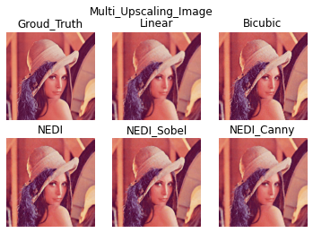

# SuperResolution-CoreLight

## Introduction

SuperResolution-CoreLight用于“芯光”队的项目管理以及进展的记录，其主要包含**软件模块 (Software)**、**硬件模块 (Hardware)**、**相关文档和资源汇总(Resources)** 、**会议讨论和项目进展的记录 (Progress.md)**等方面。下面分别对不同模块的功能进行介绍。

### 软件模块 (Software)

主要用于维护项目中软件开发相关的工程，包含针对超分辨率问题的不同实现算法、实现语言和实现方式，具体组织和描述如下：

Edge-Directed_Interpolation：存放NEDI (New Edge directed Interpolation) 的Python实现代码，目前包含了图片下采样、各类线性插值算法、原始版本的NEDI算法、加入了边缘检测算法的NEDI算法的实现、不必重复计算权重的改进型NEDI算法的实现，此外还包含PSNR、SSIM指标的计算。

wavelet_super_resolution：使用matlab实现了利用小波变换来完成超分辨率的算法，通过实验发现结果不太好，具体原因有待进一步研究。（原项目地址：https://github.com/rteammco/wavelet-super-resolution-tests）

zoom：使用C语言实现了对BMP和JPEG文件的操作，实现了针对这两种图片格式的最邻近插值算法（流式处理、多线程）、简单二次线性插值算法（流式处理、多线程）、双三次插值算法（流式处理、多线程）。

Evaluate：批量对图片进行处理（下采样、上采样、对上采样的图片质量进行评估（SSIM、PSNR、LPIPS））。

### 硬件模块 (Hardware)

主要用于维护项目中硬件相关的工程，主要包括针对超分辨率算法的硬件实现、外围硬件的实现等。
Bicubic_HLS：使用vivado HLS完成图片的双三次插值算法

### 相关文档和资源汇总(Resources)

汇总在项目进行中收集到的有用的资料，方便队员之间的资源共享。

### 会议讨论和项目进展的记录 (Progress.md)

Progress.md主要用于记录队伍的进展情况、遇到的问题和接下来的计划，即时总结和归纳问题，确保队伍沿着正确的方向前进。

## Quick Start
本部分主要介绍如何快速部署和使用**软件模块 (Software)**和**硬件模块 (Hardware)**。

### 软件模块 (Software)
#### 开发环境
- Ubuntu 18.04
- gcc 7.5.0
- Python 3.6.9
- Tensorflow 2.6.2
- Opencv 4.5.5.62
- Matlab

#### 构建
- Zoom
  
    可以在Makefile文件中加入对-DTEST_MODE参数来完成对宏定义TEST_MODE的赋值，TEST_MODE可以选择以下不同的模式：
    - 0：使用 jpeg_zoom 整幅图读入缩放(临近点插值)
    - 1：使用 jpeg + zoom 流模式缩放(临近点插值、双线性插值、双三次插值)
    - 2：使用 jpeg + zoom 整图加载多线程处理模式(临近点插值、双线性插值、双三次插值+锐化)
```bash
make libs # 用于构建对JPEG图片操作的库
make target  # 完成应用程序的构建
```

#### 运行
- Edge-Directed_Interpolation (Python)

```bash
python3 edi_gray.py # 完成针对灰度图像的NEDI插值
python3 edi_rgb.py # 完成针对RGB图像的NEDI插值，可以配置边缘检测算法
python3 inedi_rgb.py # 完成针对RGB图像的改进NEDI插值算法，不必重复计算权重（还存在问题）
```

- wavelet_super_resolution (Matlab)
```matlab
run % 使用DWT算法完成图像超分辨率算法
testSRAlgorithms % 运行各类基于小波变换的图像超分辨率算法
```

- Zoom (C)
  - TEST_MODE = 0 (整幅图读入缩放)
    ```c++
    ./app 缩放文件 缩放倍数(0~1缩小，等于1不变，大于1放大)
    ./app ./in.jpg 0.25 // 完成对in.jpg图片使用最近距离插值缩小4倍
    ./app ./in.jpg 4   // 完成对in.jpg图片使用最近距离插值放大4倍
    ```
  - TEST_MODE = 1 (流模式缩放)
    ```c++
    ./app 缩放文件 缩放倍数(0~1缩小，等于1不变，大于1放大) 缩放方式(0/近距离插值 1/双线性插值 2/双三次插值)
    ./app ./in.jpg 0.25 0 // 完成对in.jpg图片使用最近距离插值缩小4倍
    ./app ./in.jpg 5.0 1  // 完成对in.jpg图片使用双线性插值放大5倍
    ./app ./in.jpg 4.0 2  // 完成对in.jpg图片使用双三次插值放大4倍
    ```
  - TEST_MODE = 2 (整图加载多线程处理模式)
    ```c++
    ./app 缩放文件 缩放倍数(0~1缩小，等于1不变，大于1放大) 缩放方式(0/近距离插值 1/双线性插值 2/双三次插值+锐化)
    ./app ./in.jpg 0.25 0 // 完成对in.jpg图片使用最近距离插值缩小4倍
    ./app ./in.jpg 5.0 1  // 完成对in.jpg图片使用双线性插值放大5倍
    ./app ./in.jpg 4.0 2  // 完成对in.jpg图片使用双三次插值+锐化放大5倍
    ```

### 硬件模块 (Hardware)
#### 开发环境
- Vivado 2018.3


## Results

### 不同插值算法效果对比
- lenna (512*512)

| 方法 | PSNR | SSIM |
| - | - | - |
| Linear | 24.310425 | 0.6465203 |
| Bicubic | 23.659489 | 0.62899595 |
| NEDI | 26.702093 | 0.70439243 |
| **NEDI_Sobel** | **26.70276**  | **0.7044268** |
| NEDI_Canny | 26.514889 | 0.6937633 | 


  
## Contribution
此项目由芯光队成员[李宣佚](https://github.com/captainnotseeingthesea)、[高文才](https://github.com/gao12)和[郑康](https://github.com/AshNameless)共同维护。


